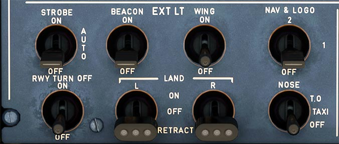
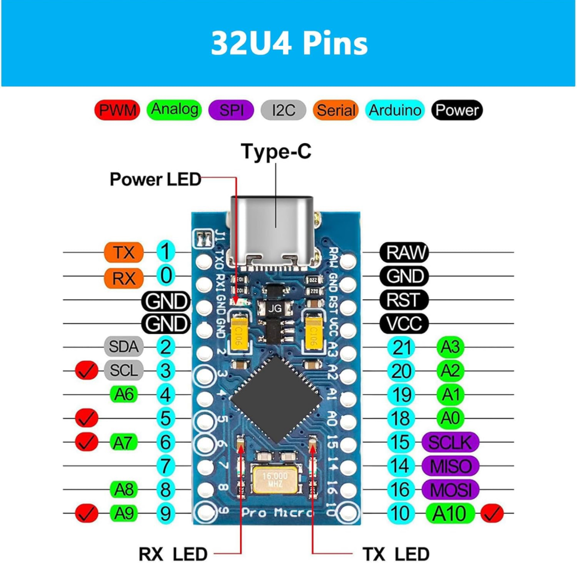

| Supported Targets | Arduino Mirco | Atmega32u4 |
| ----------------- | ------------- | ---------- |

# A320 overhead light panel controller

* [What is this?](#what-is-this)
* [Whys should I use this?](#when-should-i-use-this)
* [Getting started](#getting-started)
  * [Requirements](#requirements)
    * [Hardware](#hardware)
    * [Software](#software)
  * [Configure the project](#configure-the-project)
  * [Debugging](#debugging)
* [Circuit diagram](#circuit-diagram)
* [Print file](#print-files)
* [Contribute](#contribute)
  

# What is this?

This project has the intention to build an A320 overhead panel, especially the lighting control panel area.
Maybe in the future this project will be extended with other functions of the overhead panel.

This project uses the [ArduinoJoystickLibrary](https://github.com/MHeironimus/ArduinoJoystickLibrary) by [MHeironimus](https://github.com/MHeironimus).

> **_NOTE:_**  
This project is configured so that it can be executed directly in Microsoft VS Code.
Simply clone the project and open it in VS Code.
If you do not have the [PlatformIO](https://platformio.org) extension installed, VS Code will ask you to install it.

The panel to be reconstructed looks as follows.

My replica of the panel looks like this.
 
IMAGE
     

> **_NOTE:_**  
I am not happy with the switch heads and the switch covers themselves.
That is also the reason why these parts are not mounted.
They definitely need improvement, but at the moment I have to step back from the project and start again later to design proper switch heads that are fixed in the axis of along the lever axis.

  

# Why should I use this?

It is entirely up to you how you use this project.
You can use this project as an example, as inspiration or simply as it is.
  

# Getting started

Let get started and find out how you can use the project.
 

## Requirements

As always, we have a few prerequisites for using this project.
You can find out what these are below.
  

#### Hardware

The project is only tested with an Arduino Micro derivative with the Atmega32u4 chip.
I used this [Arduino Mirco](https://www.amazon.de/dp/B0CXXPNQS1?ref=ppx_yo2ov_dt_b_fed_asin_title) derivative.

  

#### Software

To use the light control in your flight simulator, you should use third-party software to connect the buttons/switches directly to the simulator variables.
Why?
In MSFS 2020, for example, you cannot map all lights of the A320 to buttons.
For this reason, I have chosen the app [SPAD.next] (https://www.spadnext.com/home.html).
To make it as easy as possible for you to get started, you will find a [SPAD.next profile]() for the [Fenix A320 family](https://fenixsim.com/) in the [doc]() folder.
  

## Configure the project

Before you build and install the project, make sure that the HID report ID matches your system.
To check this, take a look at the file [main.h](src/main.h#L19) in line 19.
I only used `0x05` because I operate two other devices of this type.
  

## Debugging

If you have problems with the Arduino, you can activate [debug mode](src/main.h#L16) and use the serial monitor to see the debug messages.
Example output of the debug mode.

    
IMAGE
     

  

# Circuit diagram

To be able to use the Arduino micro without additional ICs or similar, I decided to connect each switch to the analog inputs of the micro via a voltage divider.
With this circuit, I could easily read out all switch states and reserve the inputs for later extensions.
I chose this approach because I had everything at home to complete the circuit.

The complete [circuit diagram]() can be found in the [doc](doc) folder.
  

# Print files

You can find all the files to build the light control panel yourself on [Cults]().
I have printed all the parts in PLA.
  

## Contribute

Pull requests are welcome.
For major changes, please open an issue first to discuss what you want to change.
Please make sure to update the tests accordingly as long as necessary.

[githubReleaseBadge]: https://img.shields.io/github/v/release/mkrimm/A320-LightPanel?color=orange&logo=github-actions